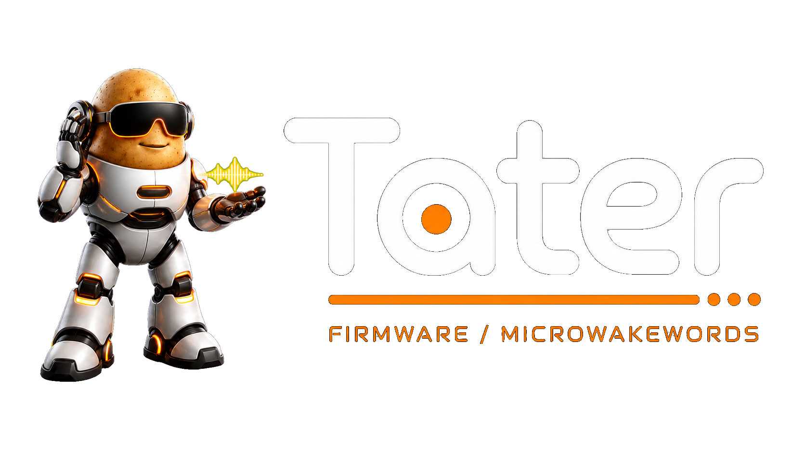

<div align="center">
  <a href="https://taterassistant.com">
    
  </a>
</div>

<p align="center">
  <a href="https://taterassistant.com">
    
  </a>
  <a href="https://discord.gg/w52namKyXT">
    
  </a>
</p>

# Tater Wake Words

Tater wake-word catalog for Tater Native satellites.

This repo stores ready-to-use microWakeWord model packages:

- `.json` Tater Native metadata files
- `.esphome.json` ESPHome-compatible metadata files
- `.tflite` model files
- `wake_word_manifest.json` for app/catalog discovery

The historical catalog folders are seeded from the original Tater wake-word collection:

- `microWakeWordsV1`
- `microWakeWordsV2`
- `microWakeWordsV3`

New issue-generated wake words are added to `microWakeWordsV6`.

## Use A Wake Word

Use the raw GitHub URL for a wake-word JSON file in Tater's satellite settings.

Example:

```text
https://raw.githubusercontent.com/TaterTotterson/Tater-Wake-Words/main/microWakeWordsV1/hey_tater.json
```

Tater Native firmware downloads the JSON and the linked `.tflite` model.

## Request A Wake Word

Open an issue with a title in this format:

```text
mww: hey potato
```

Only issues whose title starts with `mww:` are handled by automation.

When the self-hosted trainer runner completes successfully, it adds the Tater JSON, ESPHome JSON, and `.tflite` model to `microWakeWordsV6`, updates the manifest, comments on the issue, and closes it.
