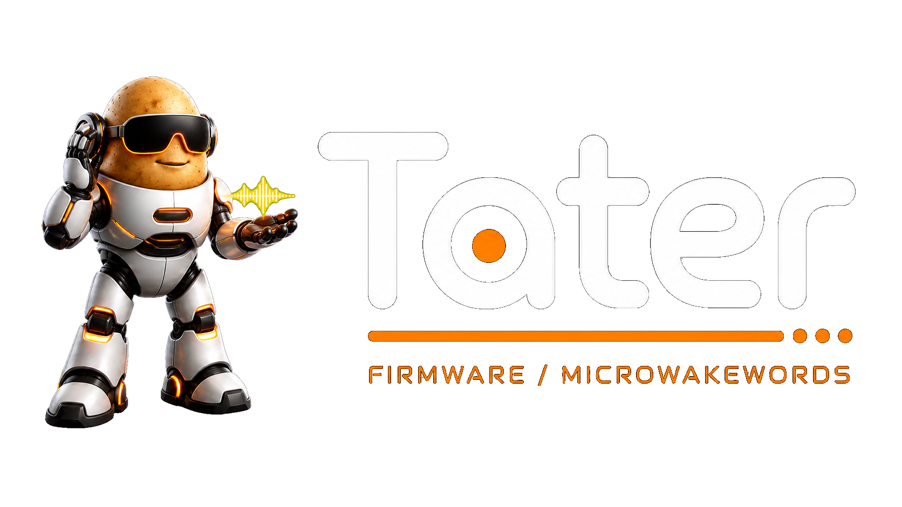

<div align="center">
  <a href="https://taterassistant.com">
    
  </a>
</div>

<p align="center">
  <a href="https://taterassistant.com">
    
  </a>
  <a href="https://discord.gg/w52namKyXT">
    
  </a>
</p>

# Tater Wake Words

Tater wake-word catalog for Tater Native satellites.

This repo stores ready-to-use wake-word packages:

- `.json` Tater Native microWakeWord metadata
- `.esphome.json` ESPHome-compatible microWakeWord metadata
- `.tflite` microWakeWord models
- `.oww.json` openWakeWord metadata
- `.oww.onnx` openWakeWord models
- `.wake-bundle.json` matched MWW + OWW dual-model bundles
- `wake_word_manifest.json` for MWW, OWW, and Dual catalog discovery

The historical catalog folders are seeded from the original Tater wake-word collection:

- `microWakeWordsV1`
- `microWakeWordsV2`
- `microWakeWordsV3`

New issue-generated wake words are added to `microWakeWordsV7`. Versions 1–6
remain available for existing MWW-only installations.

## Use A Wake Word

Use the raw GitHub URL for a wake-word JSON file in Tater's MWW satellite
settings, or use the matching `.wake-bundle.json` for an Echo satellite in
dual wake-word mode.

Example:

```text
https://raw.githubusercontent.com/TaterTotterson/Tater-Wake-Words/main/microWakeWordsV1/hey_tater.json
```

Tater Native firmware downloads the JSON and the linked `.tflite` model.

The catalog manifest exposes three views over the verified artifacts:

- **microWakeWord** uses each entry's Tater JSON URL.
- **openWakeWord** uses the OWW model from each verified V7 bundle.
- **Dual Wake Word** uses the matching MWW + OWW pair from that same bundle.

OWW and Dual catalogs start empty until the first complete V7 package is
published. Tater fills their dropdowns automatically as the issue runner adds
verified wake words.

## Request A Wake Word

Open an issue with a title in this format:

```text
mww: hey potato
```

Only issues whose title starts with `mww:` are handled by automation.

When the self-hosted trainer runner completes successfully, it adds the MWW
Tater JSON, ESPHome JSON, and TFLite model together with the OWW JSON, ONNX
model, and matched dual-model bundle to `microWakeWordsV7`. It then updates the
catalog manifest, comments with all artifact links, and closes the issue.
